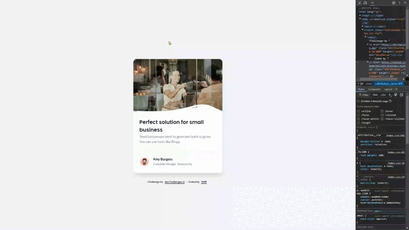

<!-- 29 Jul 2024 -->
# Business Blog Card

This challenge is a great way to practice basic HTML and CSS skills. The challenge is to create a business blog card that challenges you to use flexbox, positioning.

## The challenge :muscle:

🔳 Create a card component that matches the given design.

🔳 Use HTML to create the basic structure.

🔳 Use CSS to style the card.

🔳 Deploy the solution and submit Repository URL and Demo URL.

## Screenshot :camera:

## Links :link:

[Live site URL](https://mendezpvi.github.io/dCh-business-blog-card/) 👀

[Solution in devChallenges](https://devchallenges.io/solution/14401) 👀

## Built with :hammer_and_pick:

✅ Semantic HTML markup

✅ CSS custom properties

✅ Utility classes

✅ Flexbox

✅ CSS Grid

## Author :beginner:

✨ Frontend Mentor - [@mendezpvi](https://www.frontendmentor.io/profile/mendezpvi)